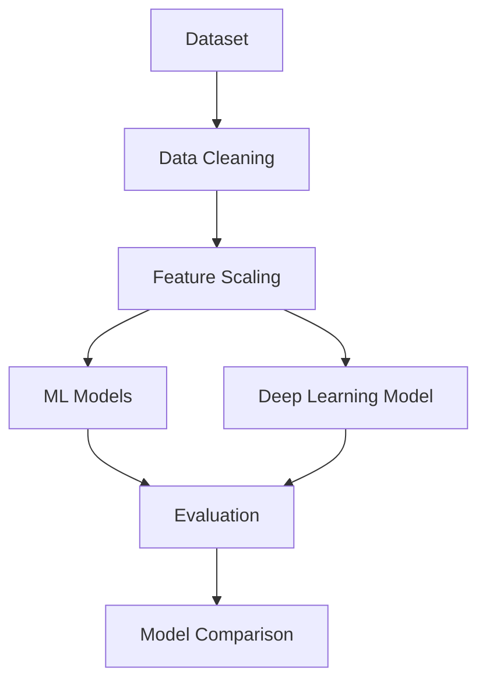

# 🧠 Breast Cancer Prediction  
### Machine Learning & Deep Learning for Medical Diagnosis  

 

  

---

## 📖 Overview

This project develops an intelligent classification system to predict whether a breast tumor is **Benign (B)** or **Malignant (M)** using Machine Learning and Deep Learning models.

The main objective is to compare classical ML approaches with Artificial Neural Networks to determine performance differences on structured medical data.

---

## 🏥 Medical Context

  

Breast cancer remains one of the leading causes of cancer-related deaths worldwide.  
Early detection significantly improves survival rates.  
Artificial Intelligence can assist medical professionals in decision-making processes.

---

## 📊 Dataset Description

The dataset includes numerical features computed from digitized images of breast mass cell nuclei.

### Feature Categories:
- Radius
- Texture
- Perimeter
- Area
- Smoothness
- Compactness
- Concavity
- Symmetry
- Fractal Dimension

Each feature is provided as:
- Mean
- Standard Error
- Worst Value

### Target Variable:
- `M` → Malignant  
- `B` → Benign  

Binary Supervised Classification.

---

## 🔄 Project Pipeline

## 🤖 Models Implemented

- Machine Learning

- Logistic Regression

- Support Vector Machine

- Random Forest

## 📈 Evaluation Metrics

- Accuracy

- Precision

- Recall

- F1-Score

- ROC-AUC

- Confusion Matrix

- Stratified Cross-Validation

## 🛠 Tech Stack

- Python

- Pandas

- NumPy

- Scikit-learn

- TensorFlow / Keras

- XGBoost

- Matplotlib

- Seaborn

- Jupyter Notebook

## 🚀 Installation

or ``conda``::

    git clone https://github.com/your-username/breast-cancer-prediction.git
    cd breast-cancer-prediction
    pip install -r requirements.txt
    jupyter notebook

    
## 🎓 Research Contribution

Comparative study between ML and DL

Robust evaluation via cross-validation

Feature importance analysis

Reproducible AI pipeline

## 📄 License

MIT License

👨‍💻 Developed by Jean KONAN

Master 2 – Big Data & Artificial Intelligence

